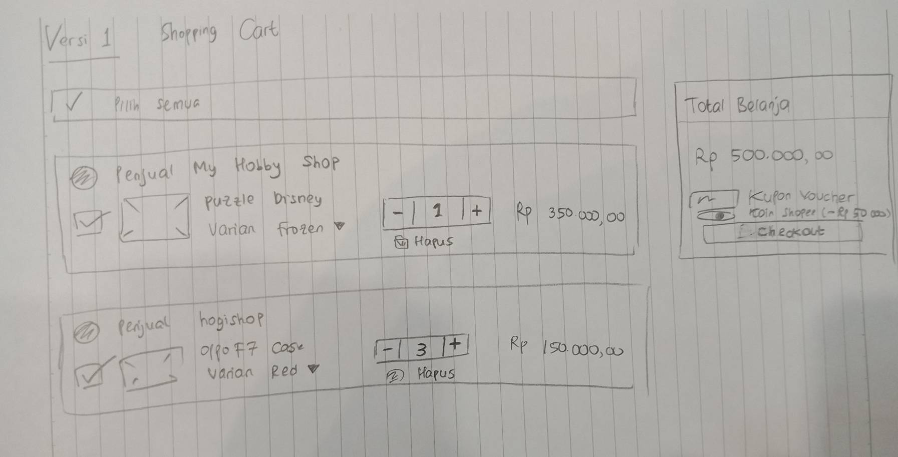
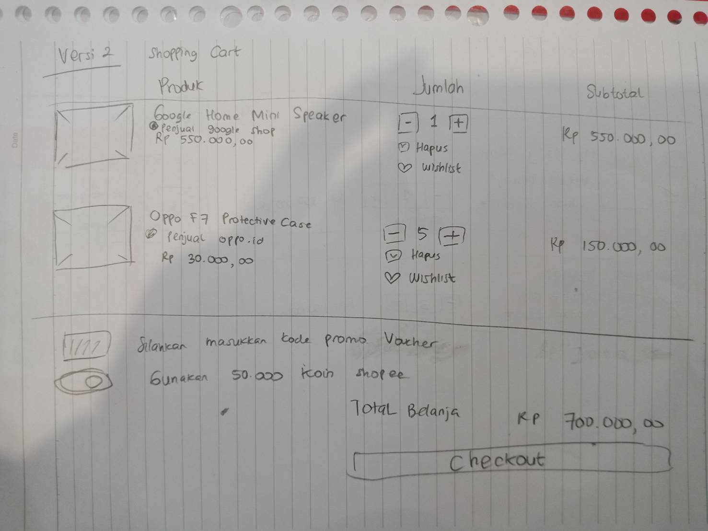
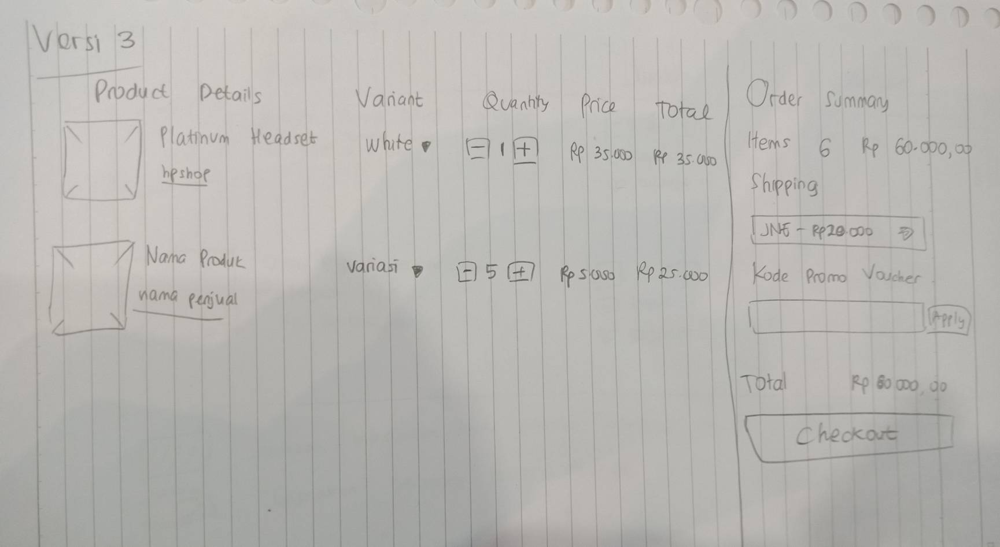
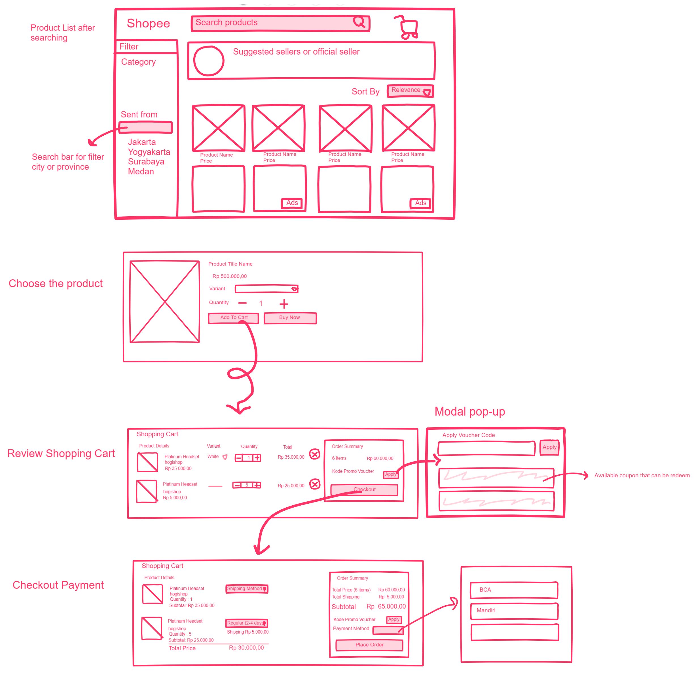

# Sketching and Prototyping
Using the information in the results of Assignment 1 for what is good and bad about the UI for designed tasks, we are going to make **Sketches** and **Prototypes**. These sketches and prototypes will lead to better design in Assignment 3. The prototypes will be then tested through a usability evaluation followed by design revision in Assignment 4.

## Part A: Sketches
Sketch at least **3 (three)** different UIs for the functions you are targeting. These three interfaces should be _dramatically different_ in terms of design directions. For example, they can be with different organizations of what functions on each screen or using a different layout of the icons, widgets, and menus on the screens. If you want, you can also incorporate non-on-screen UIs: physical buttons, gestures through motion sensors, etc.

You need **not** sketch the whole interface. It is not necessary for the sketches to have every function or every function in detail, but there should be enough to show off your general idea. **Be creative!** Draw your idea and label a few of the widgets so we can tell your intent. The goal is to have at least 3 good UIs in *interesting* ways. Sketches should be done on paper with pens and/or pencils (do not use a computer).

### 1. Scan/Photo of Sketches

#### First Version

#### Second Version

#### Third Version


### 2. Version Differences
#### First Version
On the first version, **the layout is divided into two parts**. The left side contains all products that have been inserted in the cart. It will list the products with picture attached and users can select or unselect them. First row will show the seller name and after that will show the product title with its variant if available. Next to the product title shows quantity and the total price of each products. Meanwhile, the right side contains the subtotal of the ongoing purchased items and under the subtotal, user can use 'voucher coupon' menu and used up 'koin shopee'. A blocked button of 'Checkout' is available under those.

#### Second Version
On the second version, the layout **shows all products soon to be purchased**. It is divided into three parts, which is products, quantity, and subtotal. Products shows an image and the title with a subtitle of seller's name. It also show the single price of product (or when there is a discount). Next to it will be quantity of the products with a small icon to 'Delete' and to 'Wishlist'. The last part will be the multiply of quantity and the price of the products. The bottom of the product list will show 'voucher coupon', 'koin shopee' and the subtotal of products.

#### Third Version
Third version is a combination of the first and second version. The layout is divided into two parts, where the left side is the products detail and the right side is the order summary. The left side of products will be similar to the second version with divider on products, variants, quantity, price, and total. The right side will be an order summary with total products to be bought and the amount of money spent. Under those will be voucher coupon (if exists) and the checkout button.

### 3. Selected Sketch
The third version will be my choice of design for shopping cart UI design idea. It is because it shows a **simple** list of purchased products and the subtotal is listed on the right side of the screen, which can be a focus point of items to be purchased. The list of purchased products has already divided into product details, variant, quantity, product price and the total of price. This will ease the user since they already know the division.

### 4. Design Rationale
From the contextual inquiry, user tend to search for several parts of the unnoticeable menu (for example variant menu and voucher menu). By applying the new design, user can locate the menu easily since there is already a divider upon all the parts.

## Part B: Assumptions
### 1. Hardware
```
Hardware: Desktop PC or laptop
Screen size: 14 to 16 inches
Physical input: Mouse / touchpad and keyboard
Screen resolution: minimum 1366 x 768 (low-resolution) or higher
Screen color: RGB
```
### 2. Users
```
- User should be familiar with desktop / laptop with input mouse, touchpad, and keyboard.
- User may be novice in online shopping (zero experience).
- User are able to use browser (Google Chrome, Mozilla Firefox, etc)
- User will be in the range of 12 - 65 years old.
```

## Part C: Prototypes



### Freehand Link
[Freehand Link](https://projects.invisionapp.com/freehand/document/zY57FzYCs)

### Prototype Link

##### Low Fidelity Prototype
[Low Fidelity Protoype Link](https://invis.io/NGR8KOQUQA7#/354742454_1)

##### High Fidelity Prototype
[High Prototype Link](https://invis.io/NGR8KOQUQA7#/355982563_6productlist_V1)